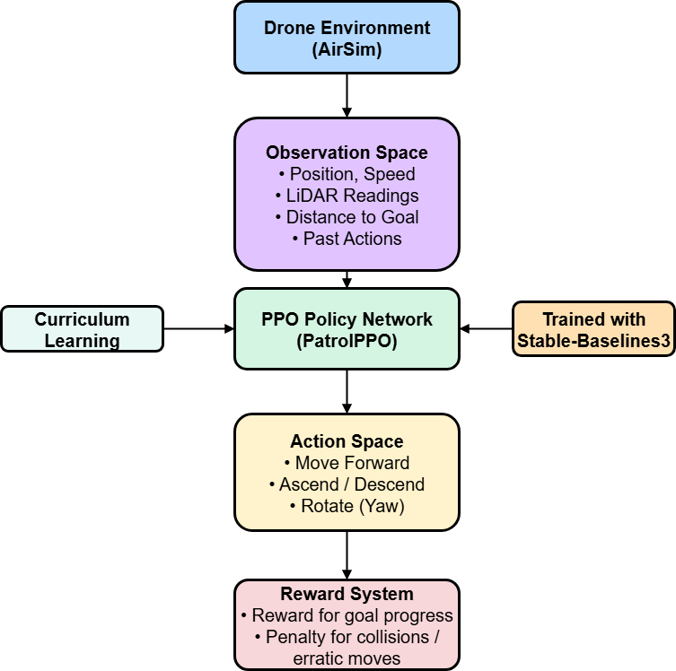

# 🚁 Drishti-AI (Lite)

### Drone-based Reinforcement Learning System for Intelligent Human Tracking

---

## 📌 Overview

Drishti-AI is an autonomous UAV surveillance system that integrates **Reinforcement Learning (RL)** for navigation with **Deep Learning-based human detection (YOLOv8)**.

The system enables a drone to:

* Navigate complex environments autonomously
* Detect and track humans in real time
* Make intelligent decisions using a closed perception-action loop

This project is based on an IEEE published research work and demonstrates a practical implementation of autonomous drone intelligence.

---

## 🧠 Key Features

* 🧭 RL-based autonomous navigation using PPO
* 👁️ Real-time human detection using YOLOv8
* 🔁 Closed-loop perception → decision → action system
* 📊 Training visualization and performance metrics
* 📈 Graph-based analysis of RL and detection performance

---

## 🏗️ System Architecture

### Pipeline:

1. Environment simulation (AirSim)
2. Observation space generation (state features)
3. Human detection using YOLOv8
4. PPO policy network decision-making
5. Action execution in drone environment
6. Reward feedback loop for learning

---

## 📁 Project Structure

airsim_env/ → UAV simulation environment setup
data/ → Processed / sample data (lightweight only)
training/ → Reinforcement learning training scripts
YoloV8/ → Human detection module
evaluation/ → Evaluation scripts and outputs
graphs/ → RL and YOLO performance graphs
logs/ → Training logs (lightweight)
assets/ → Architecture diagram
results/ → Detection outputs

---

## 📊 Results

### 🔁 Reinforcement Learning Performance

* PPO agent demonstrates stable learning and convergence
* Reward improves consistently over training episodes

---

### 👁️ YOLOv8 Detection Performance

* High accuracy human detection in simulated environments

---

### 🖼️ Sample Detection Outputs

---

## 📈 Key Metrics

* RL Average Reward: **347.0**
* Precision: **95.6%**
* Recall: **87.8%**
* mAP@0.5: **93.8%**

---

## ⚙️ Tech Stack

* Python
* PyTorch
* OpenCV
* AirSim
* YOLOv8
* Stable-Baselines3 (PPO)

---

## 🚀 How to Run

1. Clone the repository
   git clone https://github.com/your-username/drishti-ai-lite.git
   cd drishti-ai-lite

2. Install dependencies
   pip install -r requirements.txt

3. Run modules based on folder structure:

* RL training → training/
* Detection → YoloV8/
* Evaluation → evaluation/

---

## 📄 Research Paper

Published in IEEE – International Conference on Computational Intelligence and Network Systems (CINS 2025)

**Title:**
Drishti-AI: Drone-based RL System for Intelligent Human Tracking and Identification

---

## ⚠️ Note

* This is a **lite version** of the project
* Model weights and full datasets are not included
* Full implementation available upon request

---

## 🎯 Applications

* Defense surveillance systems
* Autonomous UAV navigation
* Intelligent monitoring systems

---

## 👨‍💻 Author

Adithya J
B.Tech CSE, VIT Chennai
